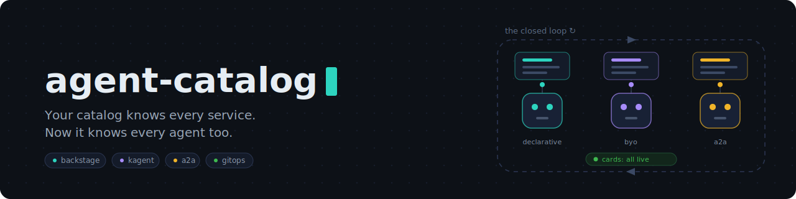
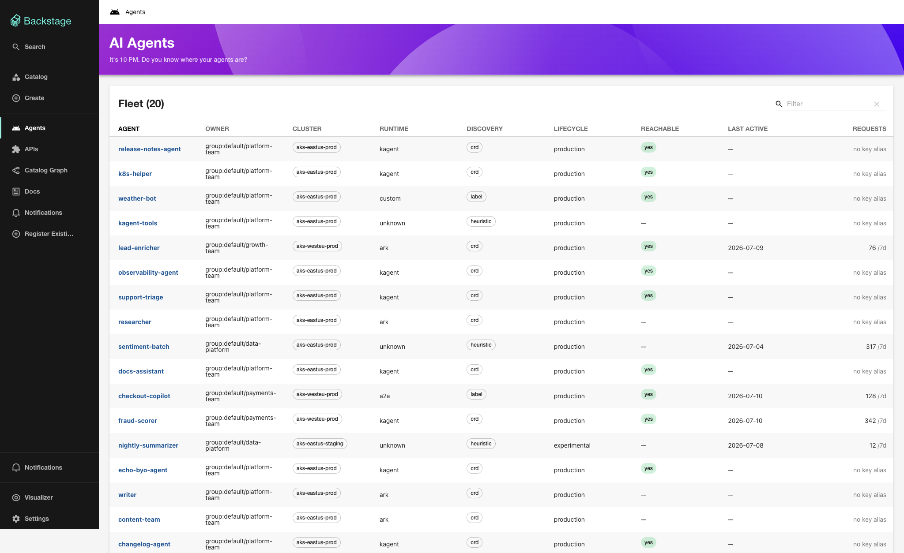
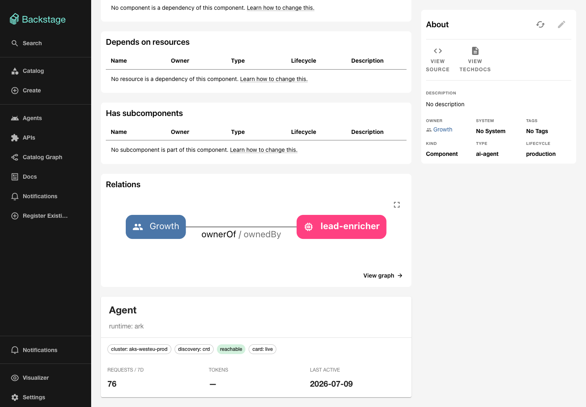

# backstage-agent-catalog

[](https://github.com/Showcall/agent-catalog/actions/workflows/ci.yml)
[](LICENSE)

> *It's 10 PM. Do you know where your agents are?*

AI agents are becoming ordinary production workloads — and most
organizations can't answer the basics about them: *what agents are running,
who owns each one, which model and tools is it allowed to use, is it
actually alive?* Your Backstage catalog already answers exactly these
questions for services. This plugin makes it answer them for agents.

## What you get

- **Agents as catalog citizens.** Every agent becomes a `Component`
  (`spec.type: ai-agent`) with an owner, a lifecycle derived from what's
  actually running, and dependency edges to its model config and the tool
  servers it may call.
- **The live agent card, not a guess.** Each agent's A2A card is fetched
  from the running agent and cataloged as an `API` entity — the catalog
  shows what an agent *actually serves*, and flags the ones that stop
  answering.
- **Any runtime.** kagent agents get the deepest integration (full
  dependency graph, BYO image provenance). Any other agent — LangGraph,
  ADK, CrewAI, a hand-rolled container — is one Service label away from
  being cataloged.
- **A golden path.** The scaffolder template turns "I want a new agent"
  into a GitOps PR; once merged and deployed, the agent appears in the
  catalog on its own. No registration step exists to forget.
- **Governance you can query.** Unowned agents, unreachable agents,
  deprecated models, over-privileged tool access — all standard catalog
  queries ([governance.md](docs/governance.md)).
- **A fleet view.** The `/agents` page: every agent across all sources with
  owner, runtime, reachability, and traction in one sortable table — plus an
  Agent card on each entity page.

## Compatibility

This is a **technical preview** (v0.1.x). While on the `0.x` line, config keys
and package APIs may still change.

| Requirement | Supported |
|---|---|
| Backstage frontend | **New frontend system only.** The `/agents` page and Agent card require `@backstage/frontend-plugin-api`. Legacy-frontend apps still get the backend module (agents land in the catalog) but **no UI** — legacy-frontend support is planned; PRs welcome. |
| Backstage backend | New backend system (`@backstage/backend-plugin-api`). |
| Node.js | 20 or 22 |
| `@kubernetes/client-node` | 1.x |
| kagent | CRD `kagent.dev/v1alpha2` |
| ARK | CRD `ark.mckinsey.com/v1alpha1` (technical preview) |
| LLM-gateway usage | LiteLLM (`/user/daily/activity`, `/team/list`) |

Only the **frontend** plugin is gated on the new frontend system; the backend
module works on any new-backend-system Backstage app.

## The demo

For the fastest local walkthrough, see [demo/README.md](demo/README.md).
It installs kagent by default, deploys a labeled A2A agent, a heuristic
shadow workload, and a LiteLLM-shaped mock usage ledger into your current
Kubernetes context. ARK can be added as an optional second controller.

1. `minikube start --cpus=4 --memory=8192`
2. `./demo/check.sh && ./demo/up.sh`
3. `./demo/backstage.sh` — creates a disposable Backstage app under
   `demo/.backstage-app`, installs these local plugins into it, and opens
   the `/agents` fleet view.

Once Backstage starts, kagent demo agents appear in the catalog within one
sync cycle, tagged `ai-agent`, with owners and model/tool dependencies.

### What the demo looks like

The fleet view brings agents from multiple runtimes, clusters, and discovery
paths into one sortable catalog:



Each discovered agent is also a first-class Backstage Component with runtime,
cluster, reachability, lifecycle, and usage context:



For real adoption into an existing Backstage app:

1. Copy the plugins into your Backstage repo.
2. Run the **New kagent Agent** template → it opens a GitOps PR.
3. Merge. Argo CD applies the manifest; the agent starts.
4. Next sync, the new agent is in the catalog — owned, discoverable,
   card fetched live. Nobody registered anything.

The same loop works without kagent: deploy any container that serves an
A2A card, label its Service `agentcatalog.io/a2a: "true"`, and it shows up
too.

## Quick start (into an existing Backstage app)

1. Copy `plugins/catalog-backend-module-agent-catalog` and
   `plugins/plugin-agent-catalog` into your repo's `plugins/` and add them
   to the workspace.
2. Wire the backend module into `packages/backend/src/index.ts`:
   ```ts
   backend.add(import('@showcall/backstage-plugin-catalog-backend-module-agent-catalog'));
   ```
3. Add the frontend plugin package to your app dependencies. With
   `app.packages: all`, Backstage's new frontend system discovers the
   `/agents` page automatically. For classic/custom sidebars, add the nav
   item explicitly:
   ```tsx
   import { AgentCatalogSidebarItem } from '@showcall/backstage-plugin-agent-catalog';

   // inside your Sidebar:
   <AgentCatalogSidebarItem />
   ```
4. Configure `app-config.yaml`:
   ```yaml
   agentCatalog:
     defaultOwner: group:default/platform-team
     excludeNamespaces: [kube-system]
     schedule: { frequencyMinutes: 5, timeoutMinutes: 2 }
     clusters:
       - name: local
         # uses default kubeconfig loading; or:
         # kubeconfigPath: /home/you/.kube/config
         # context: kind-kagent-demo
         # inCluster: true   # when Backstage runs in the cluster
     # cardEnrichment:            # live A2A-card fetching (on by default)
     #   timeoutMs: 2000
     #   port: 8080
     #   paths: ['/.well-known/agent-card.json', '/.well-known/agent.json']
     # a2aDiscovery:              # labeled-Service discovery (on by default)
     #   labelSelector: agentcatalog.io/a2a=true
     #   claimedBy: [{ group: kagent.dev, kind: Agent }]
     # usage:                     # traction from the LLM-gateway ledger (ADR 0008)
     #   enabled: true
     #   source: litellm
     #   baseUrl: http://litellm.gateway:4000
     #   apiKeyEnv: LITELLM_SPEND_KEY   # spend-scoped key, via env
     #   windowDays: 7
     #   includeCost: false
   ```
5. Register the scaffolder template (catalog locations or the UI):
   `templates/new-kagent-agent/template.yaml`

### Cluster access (authentication vs. authorization)

Two separate concerns, often conflated:

- **Authentication** (*who* the backend is) is **your cluster's** job, not this
  plugin's. agent-catalog uses whatever credentials `@kubernetes/client-node`
  loads — either an in-cluster ServiceAccount token or a kubeconfig — and never
  handles login itself. If your kubeconfig authenticates via an exec plugin
  (`aws eks get-token`, `gcloud`, OIDC, …), that all happens upstream; the
  plugin just presents the resulting identity.
- **Authorization** (*what* it may read) is [deploy/rbac.yaml](deploy/rbac.yaml):
  a least-privilege, read-only `ClusterRole` (services/endpoints `list`,
  `services/proxy` `get` for card fetches, `deployments` `list`, kagent/ARK CR
  reads). Kubernetes checks it *after* authentication succeeds. Never use an
  admin kubeconfig.

Bind that `ClusterRole` to the identity your backend actually runs as:

| Deployment (`agentCatalog.clusters[]`) | Identity | Binding |
|---|---|---|
| `inCluster: true` (Backstage runs in the cluster) | the pod's ServiceAccount | Run the backend **as** `backstage/agent-catalog`; `deploy/rbac.yaml` binds it as-is. |
| `kubeconfigPath` / `context` (Backstage runs outside) | whatever the kubeconfig authenticates as | Edit the `ClusterRoleBinding` subject to that user/group/SA. |

The manifest defaults to ServiceAccount `agent-catalog` in namespace
`backstage` — adjust the namespace/name/subject to match your deployment.

### Before you trust it (10 minutes)

The transforms target kagent CRD **v1alpha2** (group `kagent.dev`), but
kagent is a young project — verify the shapes against *your* cluster and
adjust `src/provider/types.ts` / `transforms.ts` if fields moved:

```bash
kubectl get crd agents.kagent.dev -o jsonpath='{.spec.group} {.spec.versions[*].name}'
kubectl get agents.kagent.dev -A -o yaml | head -80
```

Check specifically: `spec.declarative.modelConfig` (string),
`spec.declarative.tools[].mcpServer.name`, `spec.declarative.a2aConfig.skills`,
and the Ready condition type. kagent's CRD uses conversion strategy `None`,
so always author manifests in the storage version — a v1alpha2 cluster
silently prunes flat v1alpha1 fields. The unit tests use fixtures; update
them to match your real CRDs and keep them honest.

Code targets `@kubernetes/client-node` 1.x (object-style params); on 0.x
the list calls take positional args.

## Entity model

| Source | Backstage entity | Notes |
|---|---|---|
| kagent `Agent` CRD | `Component`, `spec.type: ai-agent` | owner from `backstage.io/owner` **annotation**, lifecycle from Ready condition |
| Live A2A card (`/.well-known/agent-card.json`, fallback `agent.json`) | `API`, `spec.type: a2a` | the real served card; synthesized from the CRD only as unreachable fallback |
| kagent `ModelConfig` CRD | `Resource`, `spec.type: llm-model-config` | agents `dependsOn` it |
| Tool / MCP references | `dependsOn` relations | the governance view: what may this agent call |
| Any `Service` labeled `agentcatalog.io/a2a=true` | `Component` + `API` from its live card | runtime-agnostic; owner/lifecycle from Service metadata; runtime-owned Services skipped |

Agents are Components rather than a custom kind on purpose: the entire
plugin ecosystem — scorecards, search, ownership, orphan reports — keys off
the well-known kinds ([ADR 0002](docs/adr/0002-component-not-custom-kind.md)).
Flat, greppable facts live in `agentcatalog.io/*` annotations; rich
structured data rides in `spec.agent`.

## Where this sits

**Not an agent runtime.** Runtimes — [kagent](https://kagent.dev)
(Solo.io), ARK, Dapr Agents, the hosted platforms — run, reconcile, and
operate agents. This project runs nothing: it's the org-wide catalog view
across all of them, next to the services, APIs, and teams already in your
portal. kagent is the first fully-supported runtime (deepest integration),
not the boundary of the project.

**Not an agent registry either.** A registry is where teams *publish*
agents for others to use; this catalog *observes* what actually runs —
including what was never registered anywhere. Registries are planned
catalog sources, not rivals
([registries vs. catalogs](docs/concepts.md#registries-vs-catalogs--two-different-questions)).

## Documentation

New to agents, A2A, or MCP? Start with the primer.

- [concepts.md](docs/concepts.md) — glossary + how each concept maps into Backstage
- [architecture.md](docs/architecture.md) — the closed loop; why the catalog is never in the deploy path
- [governance.md](docs/governance.md) — the three kinds of agent sprawl and what this actually solves
- [roadmap.md](docs/roadmap.md) — supported runtimes, discovery tiers, what's deliberately out of scope
- [docs/adr/](docs/adr/README.md) — significant decisions recorded as
  Architecture Decision Records, the same practice
  [Backstage itself follows](https://backstage.io/docs/architecture-decisions/):
  each one states the context, the alternatives, and the consequences.

## Current limitations (deliberate)

- **Full mutation per provider**: deleted resources disappear on the next
  successful sync; transient cluster failures keep the last successful
  per-cluster snapshot so outages do not look like mass deletions
  ([ADR 0003](docs/adr/0003-full-mutation-per-refresh.md)).
- **Frontend v1 shipped**: an `/agents` fleet page (owner, runtime,
  discovery, reachable, last-active, requests) and an Agent card on every
  agent's entity page. Future: card/skill viewer, fleet filters, the
  gateway Resource page.
- **Scaffolder PR flow assumes GitHub**; swap the publish action for
  GitLab etc. as needed.

## License

Apache-2.0
