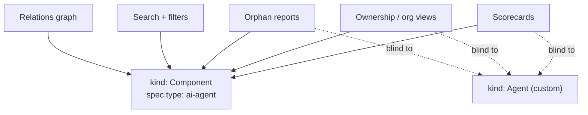

# 2. Agents are Components, not a custom entity kind

- Status: accepted
- Date: 2026-07-03 (decision predates; recorded retroactively)

## Context

Backstage lets you define custom entity kinds. `kind: Agent` is the obvious,
tempting move for an agent catalog — it reads beautifully in YAML and
signals ambition. The alternative is modeling agents as the well-known
`Component` kind with `spec.type: ai-agent`.

The non-obvious fact deciding this: **virtually the entire Backstage plugin
ecosystem keys off the well-known kinds.** Scorecards, search, ownership
views, orphan detection, TechInsights, relations graphs — they all ask
"which Components does this group own", not "which Agents".

## Decision

Model kagent Agents as `kind: Component` with `spec.type: ai-agent`.
Agent-specific facts ride in two places that don't require a custom kind:

- flat, greppable: `agentcatalog.io/*` annotations (cluster, namespace,
  model-config, reachable, card-source);
- rich, structured: a permissive `spec.agent` block for future frontend use.

A2A cards are `kind: API` (`spec.type: a2a`) and ModelConfigs are
`kind: Resource` (`spec.type: llm-model-config`) by the same logic.

## Alternatives considered

- **Custom `kind: Agent`.** Cleaner semantics on paper; in practice it opts
  out of exactly the governance tooling that makes cataloging agents
  valuable. You would rebuild scorecards, ownership and orphan views
  yourself, for zero functional gain.
- **`kind: Resource`.** Wrong semantics: agents are running, owned,
  lifecycle-bearing software, not passive infrastructure.

## Consequences

- Every existing plugin that understands Components works on agents today —
  this was verified, not assumed: stock catalog pages, ownership and
  relations views rendered agents correctly with zero frontend code.
- Filtering agents means `spec.type=ai-agent` (one query param), not a kind.
- The `ai-agent` type string becomes load-bearing public contract; renaming
  it later is a migration.
- A dedicated agent UI (card viewer, fleet view) remains possible as a
  Component *page*, no custom kind needed.
