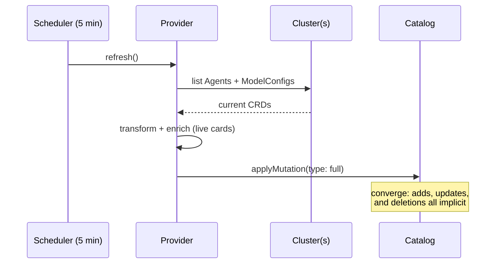

# 3. Full catalog mutation per refresh

- Status: accepted (deliberate MVP tradeoff; revisit at multi-cluster scale)
- Date: 2026-07-03 (decision predates; recorded retroactively)

## Context

An entity provider can push changes to the catalog two ways: **delta**
mutations (add/remove specific entities) or **full** mutations (here is the
complete set; converge to it). Deltas require tracking what changed;
full mutation requires only knowing the current truth.

## Decision

Every refresh lists all Agent + ModelConfig CRDs from all configured
clusters and applies one **full mutation**. The catalog converges to exactly
what exists; deleted CRDs disappear on the next sync with no tombstone
bookkeeping. Simple and self-healing — state can never drift from truth for
longer than one cycle, because every cycle starts from zero.

## The known sharp edge

One provider serves N clusters. A cluster that fails to list is skipped
(logged, not thrown) so it cannot poison the others — **but with full
mutation, skipping a cluster silently drops its previously-synced entities
until it recovers.** An outage of cluster A looks, in the catalog, like
every agent on cluster A was deleted.

## Alternatives considered

- **Delta mutations.** Correct fix for the sharp edge; requires diffing
  against previous state per cluster. Right answer later, not needed to
  prove the product.
- **One provider per cluster.** Each applies a full mutation over only its
  own entities (distinct `locationKey`), so one cluster's outage can't drop
  another's entities. The likely production shape.
- **Watch streams instead of polling.** Lowest latency, most machinery:
  reconnect handling, resync, event ordering. Unjustified at MVP.

## Consequences

- Zero drift-tracking code; deletion handling is free.
- Catalog freshness is bounded by the schedule (default 5 min).
- Multi-cluster fleets should move to per-cluster providers or deltas
  before an outage of one cluster becomes a confusing mass-"deletion".
- Live-card fetches ride the same cycle: each refresh re-fetches every
  agent's card (with per-fetch timeout and a fail-soft cache —
  [ADR 0001](0001-agent-metadata-sources.md)).
