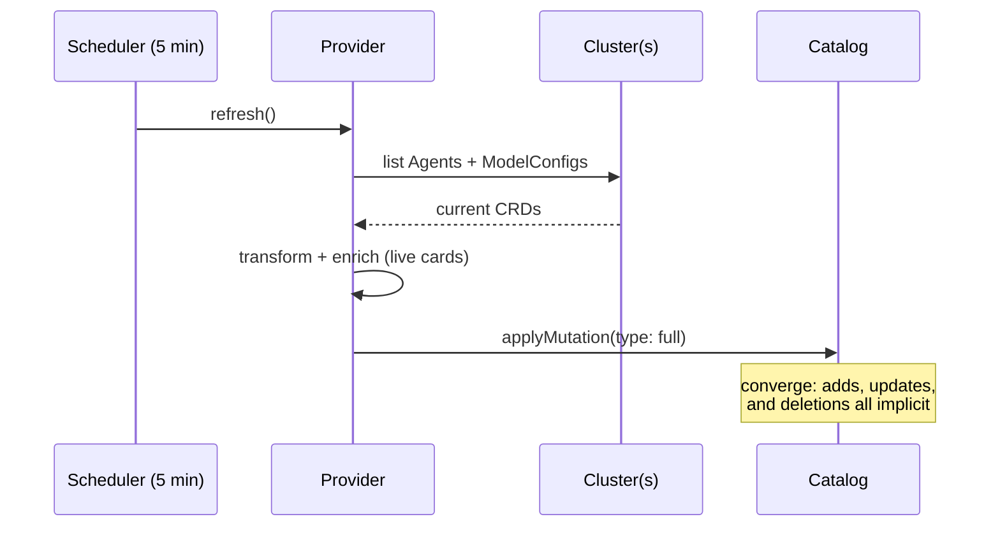

# 3. Full catalog mutation per refresh

- Status: accepted (per-cluster snapshots added 2026-07-04)
- Date: 2026-07-03 (decision predates; recorded retroactively)

## Context

An entity provider can push changes to the catalog two ways: **delta**
mutations (add/remove specific entities) or **full** mutations (here is the
complete set; converge to it). Deltas require tracking what changed;
full mutation requires only knowing the current truth.

## Decision

Every refresh lists all Agent + ModelConfig CRDs from all configured
clusters and applies one **full mutation**. Successful cluster results are
stored as per-cluster snapshots; the full mutation is built from the latest
successful snapshot for each cluster. Deleted CRDs disappear on the next
successful sync with no tombstone bookkeeping, while a transient cluster
outage keeps that cluster's last known entities instead of presenting a
mass deletion.

## The sharp edge and mitigation

One provider serves N clusters. A cluster that fails to list is skipped
(logged, not thrown) so it cannot poison the others. The provider keeps
the failed cluster's previous successful snapshot in the full mutation
until that cluster lists successfully again. A successful empty list is
still authoritative and clears the cluster's entities.

## Alternatives considered

- **Delta mutations.** Another fix for the sharp edge; requires diffing
  against previous state per cluster. More machinery than needed while the
  provider can keep per-cluster full-mutation snapshots.
- **One provider per cluster.** Each applies a full mutation over only its
  own entities (distinct `locationKey`), so one cluster's outage can't drop
  another's entities. The likely production shape.
- **Watch streams instead of polling.** Lowest latency, most machinery:
  reconnect handling, resync, event ordering. Unjustified at MVP.

## Consequences

- Zero drift-tracking code; deletion handling is free.
- Catalog freshness is bounded by the schedule (default 5 min).
- Multi-cluster outages preserve last-known entities; operators should use
  provider logs/metrics to distinguish fresh data from a stale cluster
  snapshot.
- Live-card fetches ride the same cycle: each refresh re-fetches every
  agent's card (with per-fetch timeout and a fail-soft cache —
  [ADR 0001](0001-agent-metadata-sources.md)).
