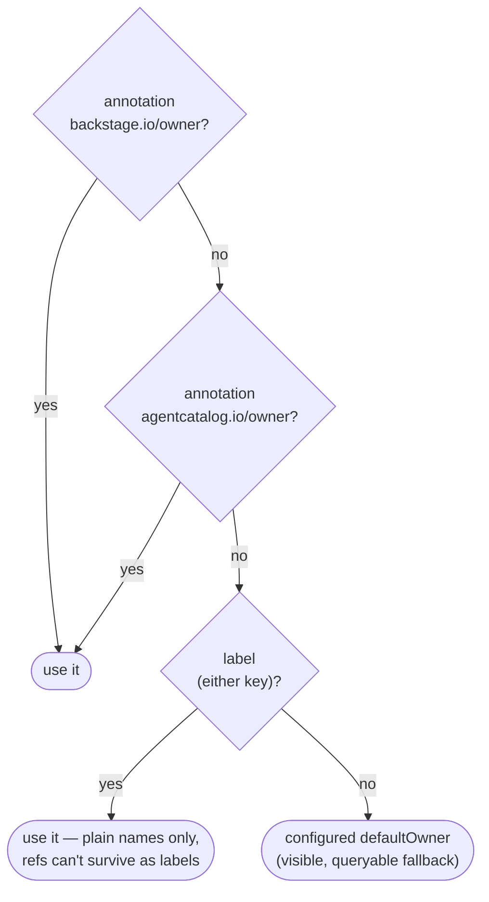

# 4. Ownership rides in an annotation, not a label

- Status: accepted
- Date: 2026-07-03 (decision predates; recorded retroactively)

## Context

Backstage owners are **entity refs**: `group:default/sre`,
`user:default/brett`. Kubernetes **label values** forbid `:` and `/` —
so the canonical owner form physically cannot be a label. Kubernetes
**annotation values** are unrestricted.

This is easy to get wrong because labels are the reflexive place to put
metadata, and a label-based scheme would appear to work in demos (where
owners are simple strings) and then corrupt or reject real entity refs in
production.

## Decision

The provider resolves ownership in priority order:



Annotations are checked **first** because they are the only place a full
entity ref survives. The label fallback exists for teams that tag plain
group names; the `defaultOwner` fallback guarantees every agent has *an*
owner — making unclaimed agents a queryable scorecard
(owner == defaultOwner) rather than an ingestion error.

## Adoption contract — document it loudly

Teams adopt ownership by annotating their Agent CRDs:

```yaml
metadata:
  annotations:
    backstage.io/owner: group:default/sre
```

The scaffolder template emits this automatically; hand-written manifests
must include it or the agent lands on the platform team's default. This is
the single most important line of YAML in the adoption story.

## Alternatives considered

- **Labels only.** Breaks on any real entity ref; silent data loss.
- **Require owner, reject unowned CRDs.** Puts the catalog in the deploy
  path (see [architecture.md](../architecture.md)) — an unowned agent
  should be *visible*, not invisible.
- **Infer from namespace → team mapping.** Attractive later as another
  fallback rung; needs an org-specific mapping source we don't have at MVP.

## Consequences

- `resolveOwner()` is four lines and a comment; the complexity lives here.
- Ownership coverage is measurable from day one (defaultOwner scorecard).
- Anyone building on this must resist "just use a label" — it will pass
  their demo and fail their rollout.
