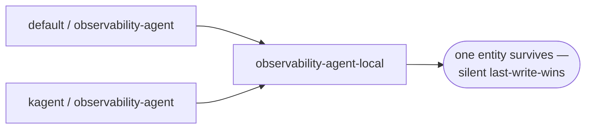

# 5. Entity naming: name + cluster — and the namespace collision

- Status: **proposed** (current scheme is live; fix recommended below)
- Date: 2026-07-03

## Context

Backstage entity names must be unique per kind within a Backstage namespace
(63 chars, `[a-z0-9-_.]`). The current scheme is:

```
component: sanitize(<agent-name>-<cluster>)          k8s-helper-local
api:       sanitize(<agent-name>-a2a-<cluster>)      k8s-helper-a2a-local
resource:  sanitize(<modelconfig-name>-<cluster>)    default-model-config-local
```

**The Kubernetes namespace is not part of the name.** Kubernetes considers
`default/observability-agent` and `kagent/observability-agent` distinct;
this scheme maps both to `observability-agent-local`.

## The collision — observed, not hypothetical

With kagent's bundled agents installed, our own `default/observability-agent`
and kagent's `kagent/observability-agent` collided on a live cluster: two
CRDs in, one catalog entity out, last-write-wins, silently.



The same flaw affects `dependsOn` references: they are built from bare
resource names (`resource:default/<modelconfig>-<cluster>`), so two
ModelConfigs named `default-model-config` in different namespaces are
indistinguishable — an agent's model dependency can point at the *wrong
namespace's* config.

## Recommendation (pending acceptance)

Include the namespace: `sanitize(<name>-<k8s-namespace>-<cluster>)` →
`observability-agent-default-local`, and build `dependsOn` refs the same
way. Keep the human-readable `title` as the bare agent name so the UI stays
clean; the entity *name* is plumbing.

Namespace-qualified names get long; 63-char truncation could itself collide.
Mitigation if it bites: hash-suffix truncated names.

## Alternatives considered

- **Map k8s namespaces onto Backstage namespaces** (instead of encoding in
  the name). Semantically the "right" use of Backstage namespaces, but
  namespace-qualified refs leak into every URL, query and relation, and
  most ecosystem tooling assumes `default`. More friction than it buys.
- **Document as a known limit, don't fix.** Defensible for the demo;
  indefensible for a governance product whose pitch is "the catalog tells
  the truth". Silent entity loss is the worst failure mode we could pick.
- **Exclude colliding namespaces via config** (`excludeNamespaces`). The
  current workaround; it treats the symptom per-install.

## Consequences of accepting

- Every provider-managed entity is renamed once (full-mutation makes this
  clean: old names drop, new names appear in one sync —
  [ADR 0003](0003-full-mutation-per-refresh.md)).
- Anything hand-pinned to old entity names (bookmarks, scorecard configs)
  breaks once. Do it before adoption, not after.
- Transform tests update to the new fixtures; `sanitizeName` unchanged.
