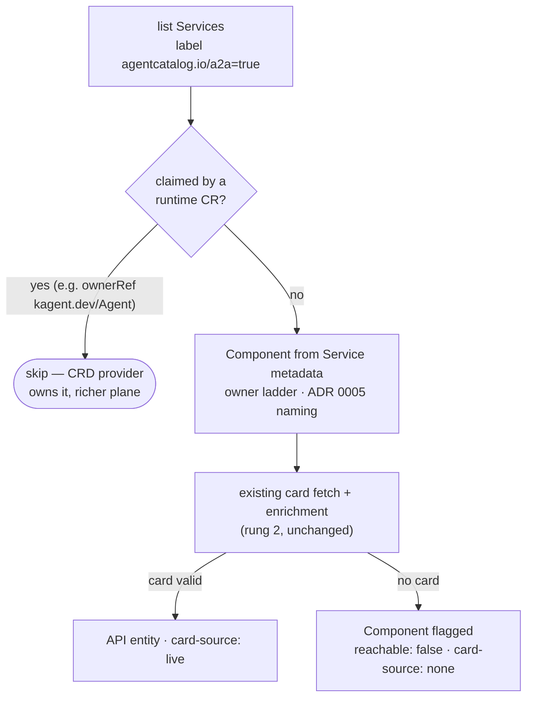

# 6. Runtime-agnostic agent discovery via labeled Services

- Status: accepted (implemented 2026-07-04) — label opt-in is v1; **probe
  sweep is the stated endgame** (below)
- Date: 2026-07-04

## Context

A2A v1.0 (Linux Foundation, 150+ orgs, native in all three clouds) made the
agent card the universal join point — agents built on ADK, LangGraph,
CrewAI, LlamaIndex, Semantic Kernel, AutoGen, Strands, or the OpenAI/Claude
agent SDKs all serve `/.well-known/agent-card.json`. Rung 2 already built
the machinery to fetch and catalog cards ([ADR 0001](0001-agent-metadata-sources.md));
the only missing piece is *finding* the agents that don't come from a kagent
CRD. This is Tier A of [the roadmap](../roadmap.md): one feature that
catalogs every framework at once, instead of per-runtime adapters.

## Decision

A second entity provider, `A2ADiscoveryProvider`, discovers agents by
**opt-in label on their Kubernetes Service**:

```yaml
metadata:
  labels:
    agentcatalog.io/a2a: "true"
  annotations:
    backstage.io/owner: group:default/ml-platform  # ADR 0004 ladder, on the Service
    agentcatalog.io/a2a-port: "9000"               # optional; default: first service port
    agentcatalog.io/a2a-path: /custom/card.json    # optional; default: well-known fallback chain
    agentcatalog.io/runtime: langgraph             # optional self-report; default "unknown"
```



The mechanics:

1. **Services, not Deployments.** The Service is the network identity and
   the existing kube-proxy fetch path targets Services. An agent without a
   Service isn't reachable by anyone, including us.
2. **Opt-in via label** (labels are server-side selectable; one cheap LIST).
   Same adoption-contract philosophy as the ADR 0004 owner annotation: one
   line of YAML, documented loudly.
3. **Card path fallback chain** (applies to *both* providers): try
   `/.well-known/agent-card.json` (A2A v1.0 well-known), then
   `/.well-known/agent.json` (kagent, older spec). Annotation overrides win.
4. **Dedup — "claimed" Services are skipped.** A Service with an
   ownerReference to a known runtime CR (default list: `kagent.dev/Agent`;
   configurable so ARK/Dapr providers can register theirs) is that
   provider's job. CRD providers take precedence because their governance
   plane (modelConfig, tools, conditions) is richer than Service metadata.
5. **Signals stay separate** ([governance.md](../governance.md)):
   `lifecycle` derives from the Service's endpoints readiness (are pods
   ready, per Kubernetes), `reachable` from the card fetch. A labeled
   Service with no valid card still yields a Component flagged
   `reachable: false, card-source: none` — a dead or misconfigured agent is
   a governance finding, not a skip.
6. **Honest thinness.** Discovered agents carry no `dependsOn` — nothing
   declares their model or tools. The visible richness gap between
   discovered and CRD-managed agents is the incentive toward the golden
   path, by design.
7. **Own provider, own `locationKey`** (per [ADR 0003](0003-full-mutation-per-refresh.md)):
   full mutations from the kagent provider and the discovery provider
   cannot clobber each other.

Config:

```yaml
agentCatalog:
  a2aDiscovery:
    enabled: true
    # labelSelector: agentcatalog.io/a2a=true      # default
    # claimedBy: [{ group: kagent.dev, kind: Agent }]  # default
```

## Alternatives considered

- **Probe every Service for a card.** Deliberately deferred, not rejected —
  the project's own governance story says the shadow agents nobody labeled
  are where the real value is. Probing is invasive as a *default* (O(cluster)
  network calls per refresh, trips security tooling, false positives), so it
  ships later as a separately-scoped **audit sweep**: on-demand or low-cadence,
  namespace-allowlisted, results marked `discovery: probe` so labeled and
  swept agents stay distinguishable. The label remains the steady-state
  contract; the sweep finds what the contract missed.
- **Per-runtime adapters first (ARK, Dapr, …).** Each covers one runtime;
  the label covers every framework immediately. Adapters become additive
  enrichment later, exactly as kagent's CRD provider is today (Tier B).
- **Annotation instead of label for the opt-in.** Annotations aren't
  server-side selectable — every refresh would list all Services.
- **Lifecycle from card-fetch success.** Zero extra calls, but conflates
  `lifecycle` with `reachable`, which the governance model keeps distinct.

## Consequences

- The project stops being a kagent catalog and becomes an **A2A catalog**
  with kagent as one (privileged) source. Positioning is unchanged: every
  runtime is a source we read, not a product we compete with.
- RBAC: the kubeconfig Backstage uses now needs `list services` and
  `get services/proxy` (+ `get endpoints`). `services/proxy` cannot be
  path-scoped — use a least-privilege ServiceAccount, not an admin config.
- A mislabeled Service (e.g. someone labels a plain web app) surfaces as an
  unreachable "agent" until the label is removed — visible and self-serve
  to fix, and arguably correct: the label *is* the claim.
- The card-validation gate (JSON object with at least `name` and one of
  `skills`/`capabilities`/`protocolVersion`) keeps HTML 200s and lookalike
  endpoints out of the catalog.
- Sub-agents spawned at runtime and agents outside the cluster remain out
  of scope (Tier C / shadow-agent frontier).
