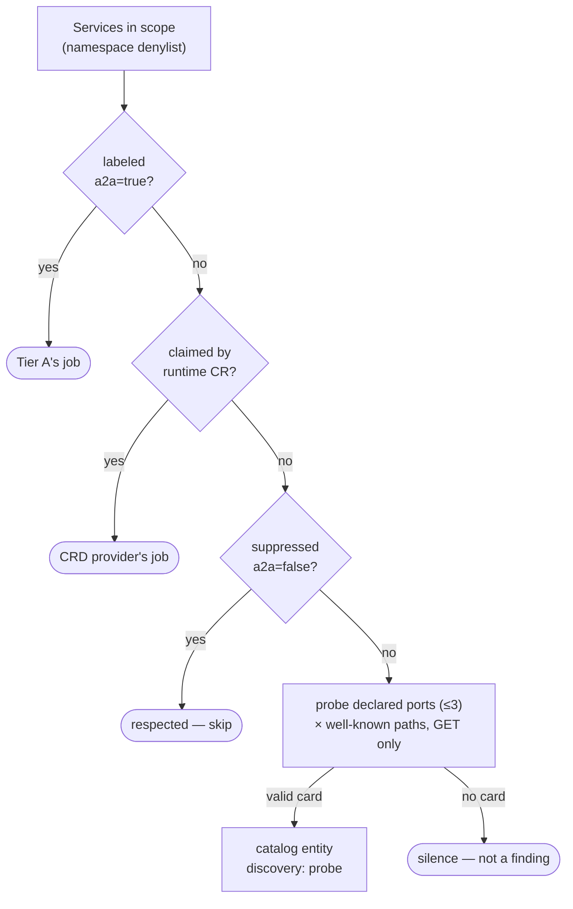

# 7. Audit sweep: probe unlabeled Services for agent cards

- Status: accepted (design settled 2026-07-04; implementation pending)
- Date: 2026-07-04

## Context

The Tier A label ([ADR 0006](0006-a2a-label-discovery.md)) answers *"will
teams register their agents?"* The sweep answers the question governance
actually loses sleep over: *"what's running that nobody registered?"* —
the shadow agents. Probing was named the endgame when ADR 0006 was
accepted; this ADR settles its design. The sweep is an **audit tool
operated by the platform team**, not a discovery contract for agent teams —
every choice below follows from that.

## Decision

1. **Results are full catalog entities**, marked `discovery: probe`. The
   catalog reflects reality: found = shown. A probed agent lands with the
   `defaultOwner`, so it appears in the *discovered-but-unclaimed*
   scorecard immediately — the finding **is** the entity, no separate
   report queue to rot.
2. **Trigger-first execution.** The sweep is **off by default**. When
   enabled, the primary interface is an **on-demand trigger** (the
   scheduler task is manually triggerable); a recurring cadence is
   available but only if the operator configures one — there is no default
   schedule. Platform teams build trust with supervised runs before
   automating.
3. **The finding asymmetry.** A *labeled* Service with no card is flagged
   (someone claimed agent-ness; it isn't answering). An *unlabeled* Service
   with no card is just a web service — **silence, not a finding**. This
   keeps the sweep's signal-to-noise at exactly "agents nobody registered".
4. **Scope by denylist**, not allowlist. An allowlist only finds shadows
   where you already suspect them, which defeats the purpose. System
   namespaces are excluded by default; operators extend the denylist.
5. **Suppression is the same label, inverted**: `agentcatalog.io/a2a: "false"`.
   Three states, one mechanism: `"true"` = catalog me (Tier A), `"false"` =
   confirmed not-an-agent (sweep skips), absent = sweepable.
6. **Probe surface is minimal and attributable.** GET-only, exclusively the
   well-known card paths, each candidate's *declared* ports (capped at 3),
   existing per-fetch timeout, bounded concurrency. All probes route
   through the kube API server, so audit logs attribute them to Backstage's
   ServiceAccount. **Tell your security team before enabling** — an
   unannounced port-scanner-shaped workload burns trust.
7. **Remediation is adoption.** The fix for a probed entity is one line:
   add the real label (+ owner annotation). Next Tier A cycle it flips
   `discovery: probe → label` and leaves the shadow list. The sweep's
   output is adoption pressure with a one-line fix, not a report.
8. **Own provider, own `locationKey`** (`a2a-sweep-provider`). Results
   persist between sweeps; each sweep's full mutation replaces the last.
9. **Bonus: the Tier B scout.** Agents on runtimes we have no CRD provider
   for yet (ARK, Dapr, …) get found by the sweep today if they serve a
   card — evidence for which Tier B integration to build first.

## Alternatives considered

- **Report-first (findings list a human promotes).** Gentler on-ramp if
  false positives are rampant, but adds a human queue that rots, and
  violates catalog-reflects-reality. Chosen against; the `isValidCard`
  shape gate plus the suppression label are the false-positive controls.
- **Default daily schedule.** Deferred to operator config: cadence is a
  trust decision that belongs to the platform team, not the plugin.
- **Namespace allowlist.** Politically safer, functionally self-defeating.
- **Probing arbitrary paths/ports.** Never: well-known paths on declared
  ports only. Anything more is a scanner, not a catalog.

## Consequences

- Probed entities look unclaimed *by design* — that's the pressure.
- A Service that legitimately serves card-shaped JSON but isn't an agent
  needs one `a2a: "false"` label; document this in the runbook.
- RBAC needs nothing new (same `list services` / `get services/proxy` /
  `get endpoints` as Tier A).
- Off-cluster and runtime-spawned agents remain out of scope
  ([governance.md](../governance.md) stays honest about this).
