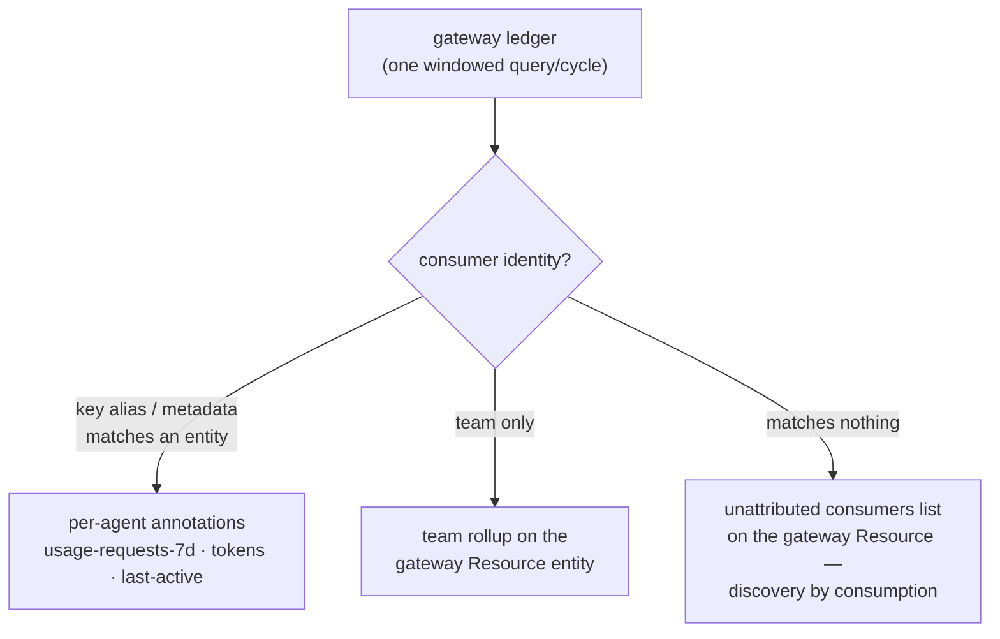

# 8. Traction from the LLM-gateway ledger (LiteLLM first)

- Status: accepted (design settled 2026-07-04; implementation pending)
- Date: 2026-07-04

## Context

The platform question that makes all the others actionable is **traction
vs. noise**: an agent live for 30 days with 14 total requests is a prune
candidate; the catalog can't say that today. The one place that sees every
LLM call *regardless of runtime or protocol* — kagent agent, labeled
Service, protocol-less script, even an off-cluster or local process — is
the org's **LLM gateway/proxy**. Its ledger already has per-consumer
requests, tokens, and cost. Reading it keeps the catalog an observer
(never in the data path, per [architecture.md](../architecture.md)).

Reality constraint: many orgs issue gateway keys **per team**, not per
agent. Per-agent traction is structurally unavailable from a shared key —
the design must be honest about that instead of smearing team totals
across agents.

## Decision



1. **A `UsageSource` interface; `LiteLLMUsageSource` first.** Same stance
   as runtimes and registries: a neutral interface, one fully-supported
   implementation to start. LiteLLM's windowed activity/spend endpoints
   provide per-key and per-team aggregates; access uses a key scoped to
   the spend routes only — the catalog reads the ledger with the least
   privilege the gateway offers.
2. **Matching ladder, honest at every rung:**
   - key alias (or key metadata) carrying `<namespace>/<agent-name>` →
     **per-agent** annotations on that entity;
   - consumer resolvable only to a team → **team-level rollup**, surfaced
     on the gateway summary entity (never stamped onto individual agents);
   - no match at all → the **unattributed consumers list** — the
     shadow-agent signal ([governance.md](../governance.md)); this is how
     local and off-cluster agents show their metabolism.
3. **One synthetic `Resource` entity per configured gateway**
   (`spec.type: llm-gateway`): holds team rollups and the unattributed
   list. Queryable and visible without polluting the agent list with
   consumers that may be humans or scripts.
4. **Agent annotations** (alias-matched only): `usage-requests-7d`,
   `usage-tokens-7d`, `last-active` (a *date*, not a timestamp),
   `usage-source`. **Dollar cost is off by default** behind a config flag
   — orgs comfortable exposing spend in the portal turn it on with one
   line.
5. **Churn control.** Usage runs on its own slower schedule (hourly
   default) and values are bucketed (rounded counts, date-granularity
   recency) so counters don't rewrite catalog entities every refresh.
   Fail-soft like the card fetch: ledger unreachable → keep last values,
   mark stale.
6. **The golden-path migration.** The scaffolder template provisions a
   per-agent virtual key (alias = `<namespace>/<name>`) for every new
   agent, so per-agent traction becomes the default for everything created
   through the golden path — the fleet migrates key-by-key, no campaign
   required.

Config sketch:

```yaml
agentCatalog:
  usage:
    source: litellm
    baseUrl: http://litellm.gateway:4000
    apiKeyEnv: LITELLM_SPEND_KEY      # key scoped to spend routes
    windowDays: 7
    includeCost: false                 # off by default
    schedule: { frequencyMinutes: 60 }
```

## Alternatives considered

- **Gateway data-plane telemetry (OTel traces/metrics).** Rich, but
  per-request plumbing and no stable consumer identity without the same
  alias convention; the ledger already aggregates with identity attached.
  Viable *additional* source later.
- **Scraping the gateway's Prometheus metrics.** Workable, but windowed
  identity-keyed aggregates come straight from the ledger API with less
  machinery.
- **Per-request log ingestion.** The catalog is an inventory, not an
  observability system; storing call history would change what this is.
- **Smearing team usage across the team's agents.** Tempting for demo
  effect, actively misleading — a team's one busy agent would make its
  nine dead ones look alive. Rejected outright.

## Consequences

- With team-keys-mostly, v1 traction is largely team-level; per-agent
  granularity arrives incrementally via the alias convention and the
  scaffolder's key provisioning. The design makes the granularity of the
  data visible rather than faking precision.
- The catalog gains its first non-Kubernetes source; the `UsageSource`
  interface is the template for Tier C API-based providers.
- "Verify before trusting" applies: gateway API shapes vary by version —
  validate the endpoints against your deployment and keep the client
  defensive.
- The gateway secret is read from an env var, never config plaintext.
