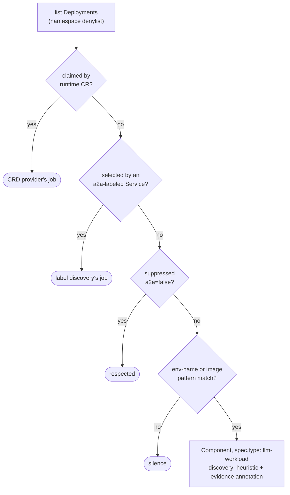

# 9. Heuristic discovery of LLM-consuming workloads

- Status: accepted (implemented 2026-07-04)
- Date: 2026-07-04

## Context

Much of real-world agent adoption speaks no A2A and has no runtime CRD — a
script in a CronJob, a FastAPI app calling a provider, a notebook promoted
to a Deployment. The label ([ADR 0006](0006-a2a-label-discovery.md)) only
catches what opts in; the sweep ([ADR 0007](0007-audit-sweep.md)) only
catches card servers. The signal that matches this chaos is simpler: **the
workload's own pod spec advertises LLM consumption** — provider-key-shaped
env *names* (`ANTHROPIC_API_KEY`, `OPENAI_API_BASE`, …) and agent-framework
image patterns.

## Decision

1. **Findings are `spec.type: llm-workload`, not `ai-agent`.** The evidence
   proves LLM *consumption*, not agent-ness — a batch summarizer isn't an
   agent, and the catalog should not fake that precision
   ([governance.md](../governance.md) discipline). The fleet view shows
   both types; the `discovery: heuristic` marker and the type keep the
   claim honest. Promotion path: if it's really an agent, label its
   Service — next cycle it becomes a first-class `ai-agent` via ADR 0006
   and the heuristic provider yields to the label.
2. **The evidence rides on the entity**: `agentcatalog.io/heuristic-signals`
   lists exactly what matched (`env:ANTHROPIC_API_KEY`, `image:langgraph`).
   A human triaging a finding sees *why* it was flagged. Env **names**
   only — values and `valueFrom` are never read (same rule as BYO,
   [ADR 0005](0005-entity-naming.md) era).
3. **Scan Deployments** (the stable workload identity), all namespaces
   minus the shared denylist. Yield-order: runtime-CR-owned workloads are
   the CRD provider's (ownerReference check, shared `claimedBy` config);
   workloads selected by an a2a-labeled Service are label-discovery's
   (selector-subset check); `agentcatalog.io/a2a: "false"` suppression is
   honored on Deployments too (same three-state label).
4. **Enabled by default.** Unlike the probe sweep, this makes *zero*
   network calls to workloads — it reads pod specs the kubeconfig can
   already list. Different risk class, different default. One config
   switch and the suppression label opt out.
5. **Usage integration applies**: an alias-matched heuristic finding gets
   traction annotations like any agent ([ADR 0008](0008-gateway-usage.md)) —
   "unregistered script, 40k requests/week" is precisely the finding that
   pays for this feature.
6. Own provider, own locationKey; ADR 0005 naming; owner ladder on
   Deployment metadata; lifecycle from `status.readyReplicas`.

Default patterns (config-extensible): env names matching
`^(OPENAI|AZURE_OPENAI|ANTHROPIC|GEMINI|GOOGLE_GENAI|MISTRAL|COHERE|GROQ|TOGETHER|DEEPSEEK|XAI|OPENROUTER|LITELLM)_(API_KEY|AUTH_TOKEN|KEY)$`
or `^(OPENAI_API_BASE|OPENAI_BASE_URL|ANTHROPIC_BASE_URL|LLM_GATEWAY_URL)$`;
images matching `langchain|langgraph|crewai|autogen|llama-?index|semantic-kernel|adk-|strands`.

## Alternatives considered

- **Emit findings as `ai-agent`.** Better demo, dishonest data — one busy
  scorecard would conflate batch jobs with agents forever.
- **Egress-based detection** (traffic to provider endpoints). Strongest
  signal, heaviest machinery (mesh/eBPF); the gateway ledger already
  covers the traffic dimension org-side. Not worth it on-cluster.
- **Scanning Pods/CronJobs/StatefulSets too.** Deployments first;
  extending the same matcher to other workload kinds is mechanical
  follow-up, not a design question.

## Consequences

- False positives are cheap and self-serve: one `a2a: "false"` label.
- False *negatives* are expected (keys via mounted files, custom env
  names) — patterns are config; the gateway's unattributed list remains
  the backstop.
- A new entity type (`llm-workload`) joins the model; fleet page and
  scorecards must include it deliberately.
