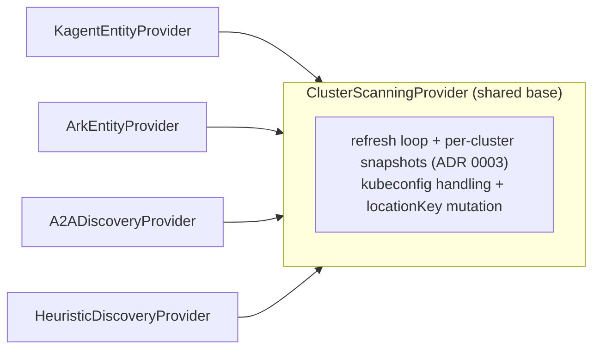

# 10. Tier B begins: ARK ingestion + the shared provider base

- Status: accepted (implemented 2026-07-05)
- Date: 2026-07-05

## Context

Tier B ([roadmap](../roadmap.md)) adds CRD-based runtimes beyond kagent.
ARK ([ark.mckinsey.com](https://mckinsey.github.io/agents-at-scale-ark/),
McKinsey/QuantumBlack) is first: its CRDs were installed on a live cluster
and verified before any transform was written — group `ark.mckinsey.com`,
version `v1alpha1`, kinds Agents/Teams/Models/Queries/A2AServers/…

Two facts from the real schemas shaped the design: `modelRef` carries an
**explicit namespace** (ADR 0005's namespace-aware refs map 1:1), and the
tools enum includes `agent` and `team` (richer dependency edges than
kagent's). ARK also introduces the catalog's first **multi-agent grouping**
(`Team`), and its arrival made this the *fourth* cluster-scanning provider.

## Decision

1. **`ClusterScanningProvider` base class.** The refresh loop, per-cluster
   snapshot cache, kubeconfig handling, and full mutation now live in one
   place; each provider implements only `collectCluster()`. The Dapr
   provider (Tier B next) becomes cheap.
2. **ARK mapping — same entity model, second runtime:**
   | ARK CRD | Backstage | Notes |
   |---|---|---|
   | `Agent` | `Component`, `spec.type: ai-agent`, `runtime: ark` | deps: namespace-aware modelRef; tools `agent`/`team` → component edges, `mcp` → resource edges |
   | `Team` | `Component`, **`spec.type: ai-agent-team`** | `dependsOn` its members (agents *and* nested teams); `team-strategy` annotation |
   | `Model` | `Resource`, `spec.type: llm-model-config` | provider/model annotations, same as kagent ModelConfig |
   | `A2AServer` | not yet | natural future tie-in to card enrichment |
3. **Teams are Components, not Backstage Systems.** An agent can belong to
   many teams; a component can belong to only *one* System. Team-as-
   Component preserves multi-membership, renders in the relations graph,
   and keeps all Component tooling. The fleet view includes
   `ai-agent-team`.
4. **A cluster without ARK CRDs is normal, not an error**: a 404 on the
   agents list means "no ARK here" — treated as a successful empty scan
   (which, per ADR 0003, clears any previous snapshot). ARK ingestion is
   therefore safe to enable by default.
5. **Lifecycle from ARK's `Available` condition** (the shared
   `readyLifecycle` also accepts it). Without a controller, agents honestly
   show `experimental`.
6. `claimedBy` defaults now include `ark.mckinsey.com/Agent`, so ARK-owned
   Services are never double-cataloged by label discovery. Usage decoration
   (ADR 0008) applies to ARK agents and teams via the same alias ladder.

## Alternatives considered

- **Team → Backstage System.** Semantically tempting, structurally wrong:
  one-system-per-component breaks multi-team membership.
- **Copy the provider pattern a fourth time.** Deferred-refactor debt with
  a fifth copy (Dapr) already scheduled; extracting the base now was
  cheaper than later.
- **Ingest Queries/Memories/Evaluators too.** Operational resources, not
  fleet identity; skip until a governance question needs them.

## Consequences

- The catalog is demonstrably multi-runtime: kagent, ARK, labeled A2A, and
  heuristic findings on one fleet page, uniformly named and owned.
- `ai-agent-team` joins the entity vocabulary; scorecards and the fleet
  view include it deliberately.
- ARK is in technical preview — the verify-before-trusting note applies
  doubly: re-check CRD shapes on upgrade (`ark.group`/`ark.version` are
  config-overridable).
- Dapr Agents remains for Tier B: different surface (Dapr annotations, no
  dedicated Agent CRD), now a small provider thanks to the base class.
