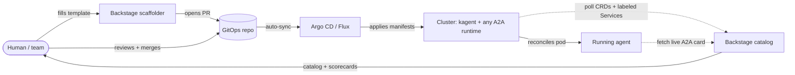

# Architecture: the closed loop

The system's one-sentence pitch: **an agent cannot run in your org without
being owned, discoverable, and governed — and nothing enforces that by
gating deploys.** This doc explains how that works and, just as importantly,
why it is *not* a chicken-and-egg problem.

## The loop

Solid arrows are the **write path** (desired state flowing toward the
cluster). Dotted arrows are the **read path** (actual state flowing back to
the catalog). The loop closes through a **human** looking at the catalog and
deciding the next change — never through a machine waiting on itself.

## Backstage has two jobs, and they never touch

1. **Authoring (write, one-shot).** The scaffolder is a form that opens a
   PR. It writes a manifest to git and its involvement ends. It deploys
   nothing. Backstage could go down five seconds after the PR opens and the
   agent would still ship.

2. **Observing (read, continuous).** Two entity providers poll the cluster —
   one for kagent Agent/ModelConfig CRDs, one for any Service opted in via
   the `agentcatalog.io/a2a` label ([ADR 0006](adr/0006-a2a-label-discovery.md)) —
   and both fetch each agent's live A2A card
   (see [ADR 0001](adr/0001-agent-metadata-sources.md)). This is a
   pull-based mirror of reality. It runs forever, independent of job 1.

Because the jobs are decoupled, the dependency graph is **acyclic**: the
catalog *consumes* the agent's card; it never writes metadata back into the
agent. The agent serves its own card whether or not Backstage exists.

## The invariant: the catalog is never in the deploy path

The moment cataloging becomes a *precondition* for an agent to run — a
webhook gate, a "must be registered first" check — you have real coupling
and a fragile system. This design keeps the catalog a pull-based observer:

| Component down | What still works |
|---|---|
| Backstage | Agents keep shipping via git + Argo; catalog catches up later |
| Argo CD | Merges queue up; running agents unaffected; catalog stays accurate about *reality* |
| An agent pod | Entity stays, flagged `reachable: false` — a governance signal, not a blind spot |
| A whole cluster | Its last successful snapshot is served until it lists successfully again, marked `source-status: unavailable` with its last successful observation — an outage never looks like a mass deletion ([ADR 0003](adr/0003-full-mutation-per-refresh.md)) |

## Eventual consistency, by design

There is a window where an agent is *declared* (merged manifest) but not yet
*enrichable* (pod not Ready, card not served). That window degrades
gracefully rather than blocking:

- The CRD-derived entity exists as soon as the provider sees the resource —
  identity, owner, lifecycle need nothing from the running pod.
- The live card fills in real skills/capabilities once the agent answers.
- If the pod never comes up, the catalog shows `lifecycle: experimental`
  and `reachable: false`. **An agent that is declared but not answering is
  exactly what governance wants surfaced.**

Think thermostat, not deadlock: the system sets a target (git) and reads the
temperature (cluster). The temperature exists whether or not anything is
looking at it.

## Source of truth, per plane

| Plane | Source of truth | Where it lands |
|---|---|---|
| Desired state | GitOps repo | cluster (via Argo) |
| Actual state | Cluster (CRDs + live cards) | catalog (via provider) |
| Governance metadata (owner, lifecycle, dependencies) | CRD | Component entity — [ADR 0001](adr/0001-agent-metadata-sources.md) |
| Interface metadata (skills, capabilities, transport) | Live A2A card | API entity — [ADR 0001](adr/0001-agent-metadata-sources.md) |

New to the terms? Start with [concepts.md](concepts.md). For what this buys
you operationally, see [governance.md](governance.md).
