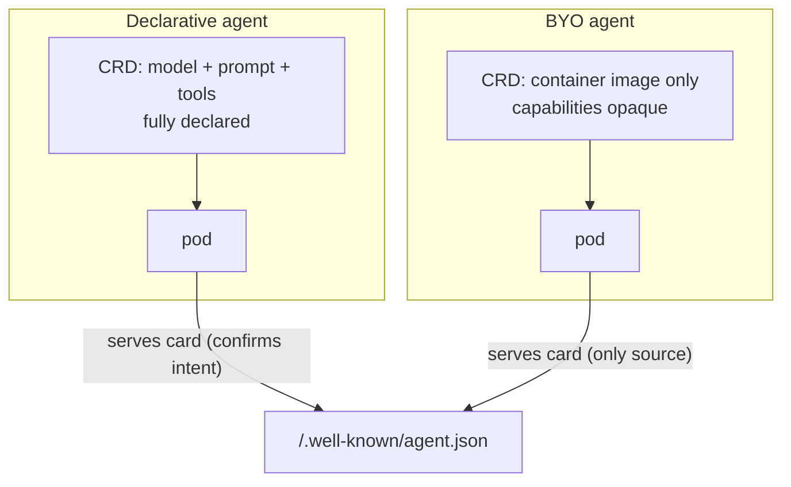

# Concepts: a primer

The AI-agent infrastructure space is young and its vocabulary is not yet
common knowledge. This page defines every concept this project touches, and
how each maps into Backstage. Read this first; everything else assumes it.

## The cast of characters

| Term | What it is |
|---|---|
| **Agent** | A long-running service whose behavior is driven by an LLM: it receives a task, reasons with a model, optionally calls tools, and returns a result. Operationally it's a pod; conceptually it's *software with judgment*, which is why governance matters more than for a stateless microservice. |
| **kagent** | A Kubernetes controller ([kagent.dev](https://kagent.dev), by Solo.io) that runs agents as first-class cluster resources. You declare an `Agent` CRD; kagent compiles it into a running deployment. This project is a *consumer* of kagent — it reads those CRDs into the catalog; it is not an alternative to kagent's runtime or UI. |
| **A2A (Agent-to-Agent)** | An open protocol for agents to discover and call each other, independent of vendor or framework. The interoperability layer of the agent ecosystem. |
| **Agent card** | An agent's self-description, served at `/.well-known/agent.json`: name, skills, capabilities (e.g. streaming), transport, protocol version. The A2A equivalent of an OpenAPI spec — and the *only* interface truth for agents whose internals are opaque. |
| **MCP (Model Context Protocol)** | The standard for exposing *tools* to models. An **MCP server** hosts callable tools (query k8s, fetch metrics…); agents reference which servers they may call. In kagent: `RemoteMCPServer` / `MCPServer` CRDs. |
| **ModelConfig** | kagent CRD binding a provider + model (e.g. Anthropic / claude-sonnet-4-5) plus the secret holding its API key. Agents reference one by name. |
| **Declarative agent** | `spec.type: Declarative` — model, system prompt, and tool references live *in the CRD*. Fully inspectable from the manifest. |
| **BYO agent** | `spec.type: BYO` ("bring your own") — the CRD carries only a container spec (image, env, resources). Model, tools, and behavior are baked inside the image, invisible to the cluster. Its live agent card is the only source of its capabilities. |
| **Agent registry** | A directory where teams *publish* agents so others can find and invoke them (the A2A ecosystem and the major clouds all ship one). Push-model: it contains what was registered. Complementary to — not the same thing as — this catalog; see below. |

## Declarative vs BYO — why the distinction runs deep

For a declarative agent the CRD is *intent* and the card is *confirmation*.
For a BYO agent there is no declared intent to read — the card is
everything. This asymmetry drives the two-plane metadata model
([ADR 0001](adr/0001-agent-metadata-sources.md)): the CRD owns the
**governance plane** (owner, lifecycle, dependencies), the live card owns
the **interface plane** (real skills, capabilities, transport), for *all*
agents.

## How it maps into Backstage

| Source | Backstage entity | Why this kind |
|---|---|---|
| kagent `Agent` CRD | `Component`, `spec.type: ai-agent` | Agents are running, owned software — see [ADR 0002](adr/0002-component-not-custom-kind.md) |
| Any `Service` labeled `agentcatalog.io/a2a=true` | `Component`, `spec.type: ai-agent` | Runtime-agnostic discovery: same kind, thinner declared plane — [ADR 0006](adr/0006-a2a-label-discovery.md) |
| Live agent card (or declared `a2aConfig` as fallback) | `API`, `spec.type: a2a` | The card *is* the agent's public interface contract |
| kagent `ModelConfig` | `Resource`, `spec.type: llm-model-config` | Infrastructure the agent depends on |
| Tool / MCP references | `dependsOn` relations | The governance view: *what may this agent call* |

Flat, greppable facts live in `agentcatalog.io/*` annotations
(cluster, namespace, model-config, `runtime`, `discovery`, `reachable`,
`card-source`); rich structured data rides in `spec.agent` for future
frontend use.

## Registries vs. catalogs — two different questions

These get conflated because both are "lists of agents," but they answer
different questions and fail in different ways:

| | Agent **registry** | This **catalog** |
|---|---|---|
| Model | Push — teams *publish* agents | Pull — providers *observe* what runs |
| Answers | "What agents can I use?" | "What agents exist, who owns them, are they answering?" |
| Contains | What was registered | What is actually running (and what was found but never registered) |
| Blind spot | The unregistered agent — invisible *by definition* | The off-cluster agent no provider covers |
| Primary user | Agent builders and callers | Platform, governance, and security teams |

A registry can't tell you about the agent nobody registered — that's not a
flaw, it's what a registry *is*. The catalog's audit sweep
([ADR 0007](adr/0007-audit-sweep.md)) exists precisely for that gap, and
`reachable: false` is a fact no registry entry carries.

The two compose rather than compete: an org's registries are natural
**sources** for this catalog ([roadmap](roadmap.md), Tier C) — as
enterprises accumulate one registry per cloud, the org-wide observation
layer that reads *across* them is exactly the role a portal catalog plays.

## Ownership, in one paragraph

Backstage owners are entity refs like `group:default/sre`. Kubernetes label
values cannot contain `:` or `/`, so the owner rides in the
**`backstage.io/owner` annotation** on the CRD ([ADR 0004](adr/0004-owner-annotation-not-label.md)).
Annotate your Agent CRDs; unannotated agents fall back to the configured
`defaultOwner` — visibly, so orphans are findable rather than hidden.

Next: [architecture.md](architecture.md) for how the pieces close into a
loop, [governance.md](governance.md) for what that buys you.
