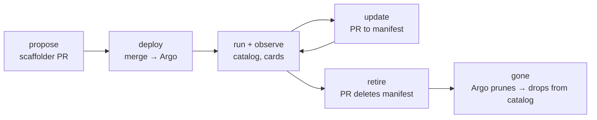

# Governance: the sprawl problem, honestly stated

"Agent sprawl" is really three different problems. This system solves one,
converts the second into a manageable inventory, and is honest about the
third. Conflating them is how governance products overpromise — so we won't.

## The three sprawls

| Kind | The failure mode | What this system does |
|---|---|---|
| **Version / drift sprawl** | Ten slightly-different copies of an agent because people tweak configs in place | **Largely solved.** One declared spec per environment in git; Argo `selfHeal` reverts out-of-band changes. The cluster is forced to match the repo. |
| **Count sprawl** | Agent #40 gets merged and nobody remembers #12 | **Converted, not prevented.** Every agent that exists is in the catalog with an owner, model, and tool dependencies. Proliferation becomes a *queryable list you can prune* — see scorecards below. Pruning remains an org discipline. |
| **Shadow / runtime sprawl** | Agents on laptops, in Lambdas, embedded in apps; sub-agents spawned at runtime | **Partially covered.** Any on-cluster agent — whatever framework — is one Service label away from being cataloged ([ADR 0006](adr/0006-a2a-label-discovery.md)), so "we don't run kagent" is no longer an excuse. What remains dark: *unlabeled* on-cluster agents (the audit sweep on the [roadmap](roadmap.md) hunts these), and anything off-cluster or spawned at runtime. |

## Lifecycle: every transition is a PR

Retirement deserves emphasis because nobody does it otherwise: **deleting an
agent is deleting a file.** Argo prunes the resource; the catalog drops the
entity on the next sync. Decommissioning becomes a first-class, auditable
action instead of the thing that never happens. Contrast the anti-pattern:
an agent started from a notebook, running forever on a key that never
rotates, that nobody remembers exists.

## The signals, and what they actually mean

Precision matters here — we verified each of these against a live cluster:

| Signal | Means | Does NOT mean |
|---|---|---|
| `lifecycle: production` | kagent's Ready condition is True: the deployment compiled and its pod passes health probes | The API key is valid, or the agent ever answered a prompt. We watched agents go Ready on a placeholder key. |
| `reachable: true` | The provider fetched the agent's live card this sync | The agent's *skills* work end-to-end |
| `card-source: live` | The API entity's definition is the real served card | — |
| `card-source: synthesized` | Card built from the CRD's declared `a2aConfig` (agent unreachable; declarative fallback) | The agent actually serves those skills |
| `card-source: stale` | Serving the last-known card; agent currently unreachable | Current truth |
| `discovery: crd` \| `label` | Which provider found the agent: a runtime CRD (rich governance plane) or the opt-in Service label (thin plane, no dependsOn). `probe` is reserved for the audit sweep. | That a `label` agent is less real — only that less is *declared* about it |

"Declared but not answering" (`production` + `reachable: false`) is a
governance finding, not a gap in the catalog.

## Scorecard queries

Each of these runs against the standard catalog API today — this is the
payoff of using well-known kinds ([ADR 0002](adr/0002-component-not-custom-kind.md)):

| Scorecard | Query sketch |
|---|---|
| **Unowned / defaulted agents** | Components with `spec.type=ai-agent` whose owner is the configured `defaultOwner` — nobody claimed them |
| **Orphaned owners** | Agent owner refs pointing at Groups that no longer exist (stock Backstage orphan tooling) |
| **Not answering** | `agentcatalog.io/reachable=false` — declared but dead or wedged |
| **Guessing their interface** | `agentcatalog.io/card-source=synthesized\|stale` — catalog can't confirm what they serve |
| **Deprecated model** | Resources of type `llm-model-config` whose `agentcatalog.io/model` is on your sunset list; walk `dependsOn` back to affected agents |
| **Over-privileged** | Agents whose `dependsOn` includes tool servers outside an allowlist |
| **Discovered but unclaimed** | `agentcatalog.io/discovery=label` with owner still the `defaultOwner` — found, but nobody's name is on it |
| **Drift (roadmap)** | Declared `a2aConfig` skills ≠ skills in the live card |

## What genuine hardening adds (beyond this MVP)

Policy checks in the PR (reject manifests with no owner, disallowed models,
tool servers off-allowlist — Kyverno/OPA/Conftest), secrets via External
Secrets/Vault instead of hand-created, a GitHub App instead of a personal
token, and environment overlays with promotion flows. None of it changes
the architecture; it upgrades each corner of the same triangle.
